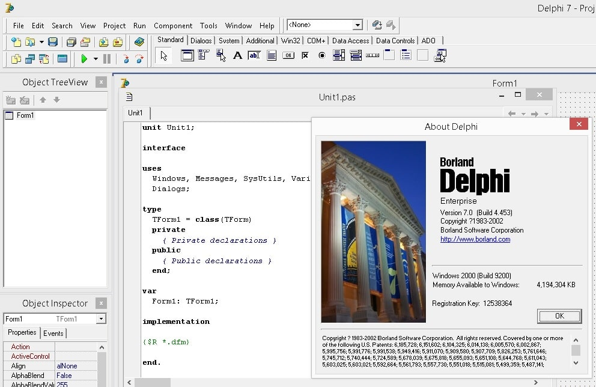
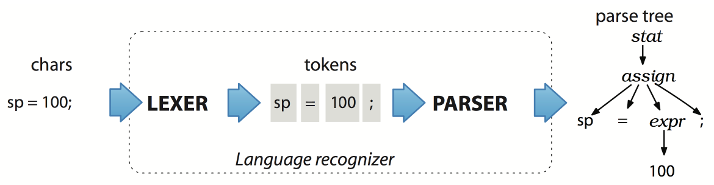
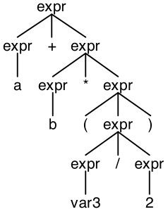
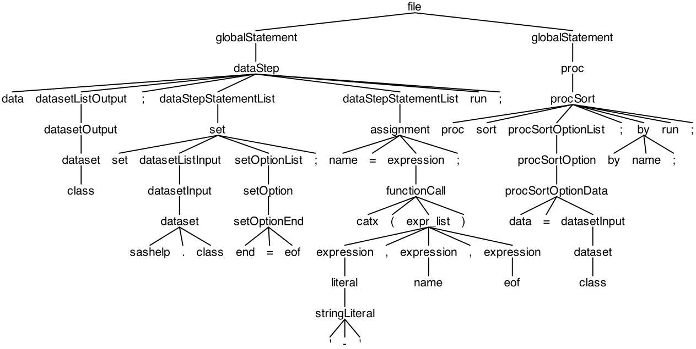
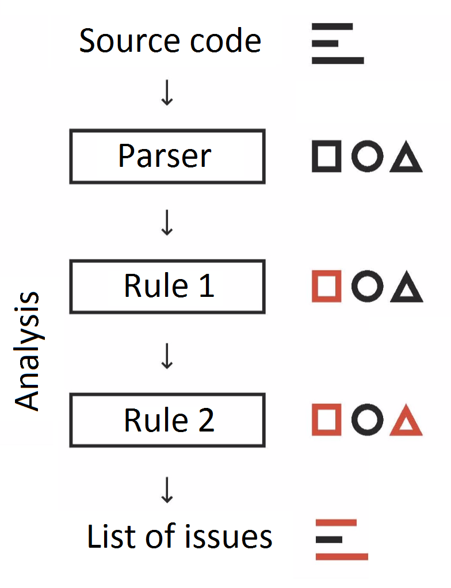
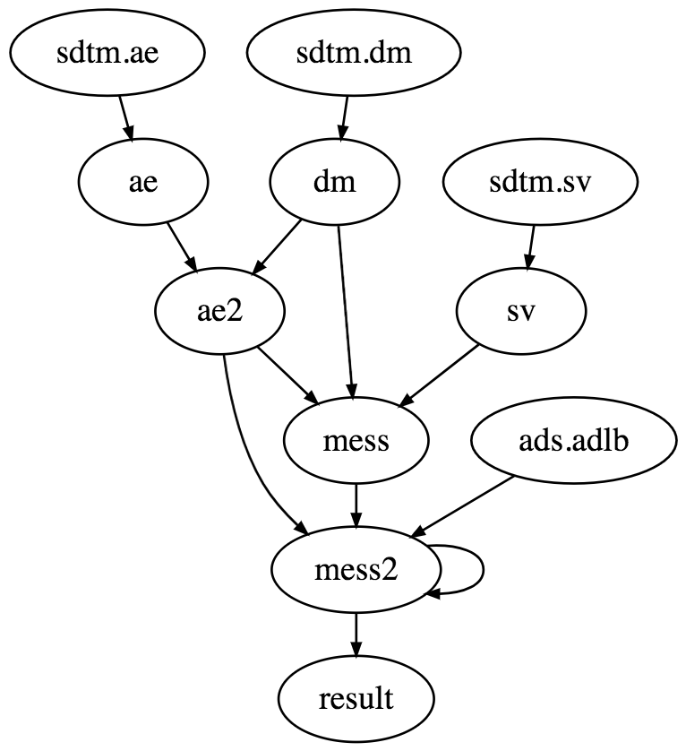

% Parsing SAS using ANTLR and several use cases for the outcome 
% Igor Khorlo
% 2018-07-05 SUGUKI 📍 London

# Announcement

## { .container-sugg }

<p id="sugg">
  SU<br>G<span style="text-align: center; margin: 0; background: url('assets/de.svg') center; background-size: contain; margin: auto; background-clip: text; -webkit-background-clip: text; color: transparent; text-shadow: none;">G</span>
</p>

## SAS User Groups in Europe

:::::::::::::: {.columns}
::: {.column width="50%"}

###### UK & Ireland

[LinkedIn](https://www.linkedin.com/company/suguki/) [meetup](https://www.meetup.com/suguki/)

###### Belgium & Luxemburg

[LinkedIn](https://www.linkedin.com/company/sas-user-group-belux/) [meetup](https://www.meetup.com/BeLux-SAS-User-Group/)

:::
::: {.column width="50%"}

###### Germany

[LinkedIn](https://www.linkedin.com/company/sas-user-group-germany/) [meetup](https://www.meetup.com/sas-user-group-germany/)

###### Poland

[LinkedIn](https://www.linkedin.com/groups/8675451)

:::
::::::::::::::

# The problem

## Background -- My Story

- Object Pascal (~2003)
- Delphi (Anders Hejlsberg, C#, Typescript)
    + IntelliSense / Autocompletion
    + Code generation

---



## What basic functionality do you expect from an IDE?

- Autocompletion
- IntelliSense
- Code checking
- Indentation support

## Better IDE

Having a good visual response is important. Even Tony Barr spoke about this -- [SAS BEGINNINGS](https://youtu.be/5SV-H8qEeAc?t=51m59s) 

# Parsing SAS

## What actually SAS language is?

- 9.2? 9.4?
- SAS Base?
- GTL?
- CASL?

## What is ANTLR

Generates LL(\*) parser. It takes grammar on the input and generates a parser in a target language (originally Java, also python, go, js, ts) on the output, also provides several helpers to walk the parse tree.

## How parser generated by ANTLR works

{ style="background:none; border:none; box-shadow:none;" }

##  ANTLR Grammar

```g4
expr: expr ( '*' | '/' ) expr
    | expr ( '+' | '-' ) expr
    | INT
    | ID
    | '(' expr ')’
    ;

ID  : [A-Za-z_][A-Za-z_0-9]* ; // match identifiers
INT : [0-9]+ ;                 // match integers
NL  : '\r'? '\n' ;             // newlines
WS  : [ \t\r\n\f]+ -> skip ;   // skip whitespace
```

## Parse Tree for 

### `a + b * (var3 / 2)`

{ style="background:none; border:none; box-shadow:none;" }

---

{ style="background:none; border:none; box-shadow:none;" }

# Problems faced

## Comments

```sas
/* This comment's bytes are processed character by character. */

* Asterisk comments are read token by token but quotes are treated like single tokens.;

%* This macro comment is read token by token until the semicolon.;
```

---

```
%macro test(dsin);   
   %* Shouldn't the single quotation mark be ignored since comment?;
   proc print data=&dsin;  
   run;
%mend;
data test;
   i=1;
run;
%test(test)
```

```
't the single quotation mark be ignored since comment?;
proc print data=&dsin;
run;
%mend;
data test;
   i=1;
run;
%test(test)
```

---

###### Results in:

```
WARNING 32-169: The quoted string currently being processed has become more than 262 characters long. You may have unbalanced quotation marks.
```

[Usage Note 32684: Using comments within a macro](http://support.sas.com/kb/32/684.html)

---

## Keywords as Identifiers

```sas
if = 1;
then = 2;
else = 3;
end = 4;

if if then 
  then = else;
else
  else = end;

drop = then;
```

---

```
data _null_;
  if = 1; and = 0;
  if if eq and and and eq if then
    put 'if = and';
  else 
    put 'if ^= and';
run;
```

## Languages compositions

- PROC SQL
- PROC IML
- PROC LUA
- PROC GROOVY

## Variety of syntax in general

- `1 =>: 2`
- `1 ~ne 2`
- `1 not <=: 2`
- `1 ~>=: 2`
- `?-y = 2` with [CHARCODE System Option](http://documentation.sas.com/?docsetId=lesysoptsref&docsetTarget=p12ulbwcvihdn8n148ho3uurhse9.htm&docsetVersion=9.4&locale=en).

## SAS Macro

```sas
%let d = dat;
%let end_token_pointer = end_token;
%let end_token = n;
%let if = __if;

%macro __if(c);if &c%mend;

&d.a smthng;
    set sashelp.class;
    %&if(%str(age > 18))then do;
        bmi = weight / height ** 2;
    e&&&end_token_pointer..d;
run;
```

## SAS Auto-correction

```
prc freq dta=sashelp.class ordor=freqq;
   tble sex / chsq;
runn;
```

```
WARNING 14-169: Assuming the symbol PROC was misspelled as PRC.
```

- [Point/Counterpoint: Should a programming language accept misspelled keywords?](https://blogs.sas.com/content/iml/2017/02/27/pointcounterpoint-misspell-keywords.html)
- [AUTOCORRECT System Option](http://documentation.sas.com/?docsetId=lesysoptsref&docsetTarget=p0mzulmnthqs2bn1cuqm5eqlvgi8.htm&docsetVersion=9.4&locale=en)


# What you can do having an AST

## Static Code Analyzer -- linter for SAS -- [saslint](https://saslint.com)

---

<pre class="saslint">
$ saslint
Inspecting 10 files
<span class="offence-good">.</span><span class="offence-good">.</span><span class="offence-good">.</span><span class="offence-error">E</span><span class="offence-error">E</span><span class="offence-good">.</span><span class="offence-warning">W</span><span class="offence-good">.</span><span class="offence-good">.</span><span class="offence-note">N</span><span class="offence-good">.</span><span class="offence-good">.</span>

Offences:

<span class="offence-path">test-errors.sas</span>:3:26: <span class="offence-error">E:22-322</span>: Missing ';' at the end of the assignment statement.
    f = cat(3, 5, 3 + 5)
                        ^

<span class="offence-path">test-errors.sas</span>:5:25: <span class="offence-error">E:79-322</span>: Missing closing ')'.
    f = cat(3, 5, 3 + 5;
                       ^

<span class="offence-path">test-warnings.sas</span>:4:9: <span class="offence-warning">W</span>: Expression is always true.
    if length(str) > 0 then do;
       ^^^^^^^^^^^^^^^

<span class="offence-path">test-notes.sas</span>:7:5: <span class="offence-note">N</span>: This DATA step uses no executable statements and can be replaced by the DATASETS procedure.
data class;
^^^^

10 files inspected, <span class="offence-error">5 offenses</span> detected.
</pre>

---

{ style="background:none; border:none; box-shadow:none;" height=600px }

---

## What is checked?

- Macro call parameters mismatches
- Wrong number of arguments in function calls
- Type mismatches
- Unbalanced quotes
- Unmasked characters in macro quoting functions 
- Truncation mistakes
- Spellchecks inside string literals

## Dataflow graph

:::::::::::::: {.columns}
::: {.column width="50%"}

```
/* ... */

data mess;
  set dm ae2 sv; 
  s = '
    data abc;
      set a b c;
      set d; 
      ss = ''
        data aabbcc;
          set aa bb cc;
        run;
      '';
    run;
  ';
run;

/* ... */
```

:::
::: {.column width="50%"}

{ style="background:none; border:none; box-shadow:none;" }

:::
::::::::::::::

##  Styleguide Control

:::::::::::::: {.columns}
::: {.column width="50%"}

```sas
DATA CLASS CLASS18;
SET SASHELP.CLASS;
BMI=WEIGHT/HEIGHT**2;
IF AGE > 18 THEN DO; OUTPUT CLASS18; END;
ELSE OUTPUT CLASS;
PROC FREQ DATA = CLASS18;
TABLES BMI;
RUN;
```

:::
::: {.column width="50%"}

```sas
data class class18;
  set sashelp.class;
  bmi = weight / height ** 2;
  if age > 18 then do;
    output class18;
  end;
  else do;
    output class;
  end;
run;

proc freq data = class18;
  tables bmi;
run;
```

:::
::::::::::::::

## Transpiling { style="text-align:left;" }

Language to language compiler.

### non-SAS

- Typescript
- Coffescript

### SAS

- PROC DS2DS2
- SAS V9 to SAS Viya 
- SAS Macro to PROC LUA

# The End

## Contact info

Igor Khorlo 

[saslint.com](https://saslint.com)

[https://www.linkedin.com/in/igor-khorlo-4546129a/](https://www.linkedin.com/in/igor-khorlo-4546129a/)

[igor.khorlo@gmail.com](mailto:igor.khorlo@gmail.com)
